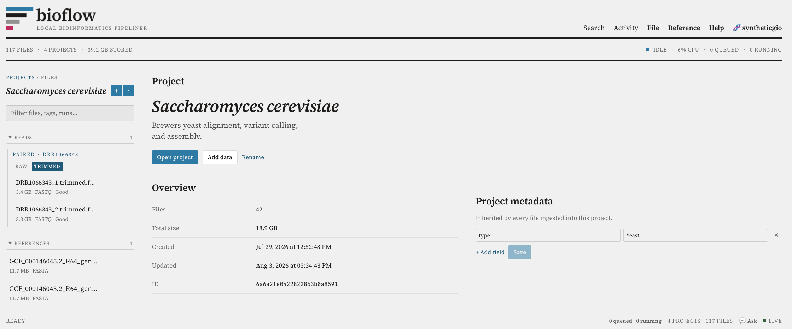
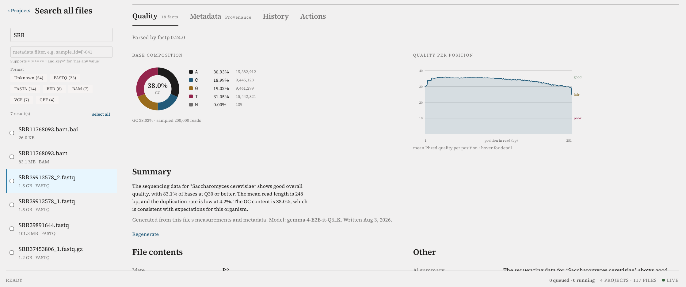
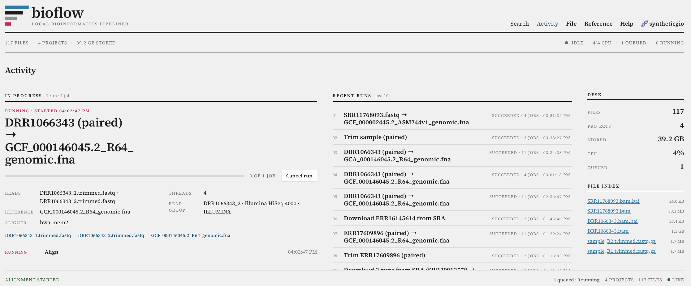

<div align="center">

<picture>
  <source media="(prefers-color-scheme: dark)" srcset="assets/lockup-horizontal-reverse.png">
  
</picture>

<br><br>

[](LICENSE)
[](https://github.com/syntheticgio/bioflow/commits/main)
[](https://github.com/syntheticgio/bioflow)
[](https://github.com/syntheticgio/bioflow/issues)
[](LICENSE)
[](#security)

[](docker-compose.yml)
[](backend/pyproject.toml)
[](frontend)
[](#storage-layout)

<strong>A local, single-user web app for managing bioinformatics data: projects, uploads,
metadata, and a priority- and load-aware background job queue.</strong>

</div>

<p align="center">
  
</p>

[Quick start](#quick-start) •
[Background](#background) •
[Security](#security) •
[Architecture](#architecture) •
[Job queue](#job-queue) •
[Optional AI Integration](#optional-ai-integration) •
[Metadata and search](#metadata-and-search) •
[Read preparation](#read-preparation) •
[License](#license) •
[Contributing](#contributing)

## Quick start

> [Docker](https://docs.docker.com/engine/install/) is a requirement.  If you're using an external drive and MacOS, see Required MacOS Setup for additional preparation needed.

#### From Cloned Repo
```bash
cp .env.example .env
make up
Then open <http://localhost:5173>
```

#### From Launcher
```
1. Download Launcher executable for either arm64 (MacOS M series) or amd64 (Linux, Intel/AMD processors)
2. Run and follow installer to set up.  Cloning the repo is unnecessary.
3. Click the Install button.
4. Run the Launcher after install to start or stop the application.
5. Then open <http://localhost:5173>.
```

Releases and versioning: see [`VERSION.md`](VERSION.md).

## Background
BioFlow is a local UI/UX web app that is trying to solve the problem of managing your bioinformatics data, keeping track of provenance, having a central place to run computations on software that you don’t remember the 100 different command line flags for, and to visualize some of the basic outputs that are common in this type of research.  There are many other projects out there which probably do this.  I know of ones like Galaxy, FDA HIVE, DNANexus, etc.  One thing that BioFlow doesn’t do thought - it is not for distributed computing like these other ones target.  Instead, all of the development time is put into making the UI responsive, easy to use and intuitive, along with some slight load balancing and queueing work.  In other words, it is letting those other platforms handle the ‘hard’ problems of bioinformatics and just addresses the ‘easy’ problems so it feels like you are doing a little more biology than informatics. Oh, and BioFlow can make use of your AI agent and offers a RESTful API (see http://localhost:8000 when running).

### Why I am writing this application
I’ve been writing this software really for my own research purposes but thought maybe some others will get use out of it.  This is the type of thing that, even though I’ve spent 15+ years in bioinformatics, I’d never have written before the AI era streamlining it.  Claude Code is doing most of the heavy lifting, guided by me.  That means I can focus on the biological science and less on the computer science.  I want to be clear though, this isn’t ‘vibe coded’.  There was no prompt to ‘write bioinformatics software and push it to GitHub’.  It has been a steady stream of features, fixes, tweaks, and updates as I use the software and find shortcomings.  If you have an issue with software written with the help of AI, this application is not for you.

### Allowable usage
This software isn’t licensed for commercial purposes (targeted for researchers and hobbyists).  If you would like to use it commercially you’ll need to reach out to me and we’ll figure out some type of licensing.  This includes running it as a SaaS service (although it’s not built for that so you’ll have to do a lot of tweaking!).  Other than commercial licensing, which I don’t honestly expect, this application is not being monetized.  There is no collection of data to sell to third parties🙈, no subscriptions🙉, and no account creation🙊.  See the [license](LICENSE) for more information.  I will point out, though, that if you fork and change, you have to make the code freely available under the terms of the license.

>🙈 There is (or will be) an optional, _opt in_ feature where you can submit data about the computations you run - the time it took & size of the various parts of it, the type of processor you have, etc.  This is purely to support the equations used for predicting how long a computation will take given the user’s machine.

>🙉 There are some AI features where you will need to BYOK or otherwise provide your own AI.  _I_ am not selling any subscription or tokens.

>🙊 There are profiles, which are just local on your computer and essentially just act as separate workspaces if you have a couple people using it.  There is no account creation in its typical meaning, and nothing that goes to any server I control.  I will not know you exist most likely.

### Support (or lack of it)
Because of all of this, I can’t offer personal support - if you’re not able to run it yourself or it doesn’t run on your machine, that is unfortunate.  I’ve taken some time to brush it off and spiff it up (added a launcher and some ability for it to run beyond my machine).  It is primarily targeted for M series Macs, although I do also use it on an Ubuntu flavored linux box on occasion.  All the instructions are in the [README.md](README.md) and I’ve made it as painless as I possibly can.  Please do not create an issue for Tech Support!  

### Issues, bugs, feature requests
If you run into any problems or bugs you’re welcome to open an issue.  If it is something I can replicate then I’ll likely fix it.  If not, I encourage you to fork the repo, fix the issue, and open a PR.  You’ll have an easier time fixing it on your machine than I will.  I’ll take a look at the PR and I may or may not merge it.  If I don’t, don’t take it personally - you have the fork after all and can run your fixed version.  I’m only accepting PRs where I completely understand the changes being made.  

For feature requests, you can open an issue if you like, or fork the repo and implement it and create a PR.  I want to be very clear though, I’m not planning on bloating this with every feature that everyone wants.  This is primarily for my personal research purposes and while I’ll take into consideration some scope change for people who request it, ultimately it gets to follow my vision.  But remember, this is open source, you are more than welcome to fork and build on it yourself so it suits your needs!  If you do make a feature request on the issues, please make sure you’re filling it out completely (there is a Feature request path when you want to create a new issue).  If I have to try to figure out what you mean because its not clear, I’m going to just simply close there issue and move on with my day. 

## Security
Before you go any further, make sure you understand how this is intended to be used from a security perspective. 
**The API has no authentication.** It's built for a single trusted user on
their own machine, and `BIND_ADDRESS=127.0.0.1` in `.env.example` keeps it
reachable only from localhost by default. Setting `BIND_ADDRESS=0.0.0.0` (or
otherwise exposing the port to a network) hands anyone who can reach it full
read/write access to every project and file — there is no login, and the
`X-BioFlow-Profile` header used to separate projects is an organizational
convenience, not an access control. Only do this on a network you trust, and
understand that's what you're doing.

## Required macOS setup

**You must share the external drive with Docker Desktop before the stack will work.**

Docker Desktop on macOS runs a Linux VM. It cannot see `/Volumes/*` unless you grant it
access explicitly:

1. Docker Desktop → **Settings → Resources → File Sharing**
2. Add `/Volumes/ExternalSSD` or whatever your external drive is mounted as.
3. **Apply & Restart**

Also recommended, under **Settings → General**: enable **VirtualizationFramework** and
**VirtioFS**. The older gRPC-FUSE backend is substantially slower for the large sequential
reads this application performs.

If the drive is not shared, `/readyz` fails with an explicit message naming the problem
rather than the application silently writing into the VM's own filesystem.

## Architecture

| Component | Choice | Notes |
|---|---|---|
| API | FastAPI (Python 3.12) | async; large-file work never runs on the event loop |
| Worker | Custom, Redis-backed | priority classes + load-aware admission (Phase 4) |
| Database | MongoDB **single-node replica set** | replica set is required for transactions |
| Queue | Redis sorted sets + Lua | atomic claim; Mongo remains the record of truth |
| Frontend | React + TS + Vite | TanStack Query (server state) + Zustand (UI state) |
| Storage | Content-addressed | `objects/<sha256[:2]>/<sha256>` |

### Storage layout

Everything lives under `BIOINFO_HOME` (`/data` inside containers):

```
objects/ab/abcdef...     content-addressed blobs, mode 0444
staging/                 in-progress chunked uploads
tmp/                     job scratch (same filesystem as objects/, for atomic rename)
logs/                    per-job captured output
.biopipe/VERSION         mount sentinel — see below
.biopipe/lock            flock; prevents two stacks sharing one home
```

Files are stored by the SHA-256 of their content, so uploading the same reference genome
twice costs one copy. Human-facing names, projects, and metadata live in MongoDB. A
separate `blobs` collection refcounts each unique piece of content; garbage collection
only unlinks a blob after its refcount has been zero for over an hour.

### The mount sentinel

If the external drive unmounts, the container sees an **empty `/data`**, not an error.
Without a guard, one verification pass would flip the entire library to "missing."

`.biopipe/VERSION` is written at initialization. Every verification batch checks it first
and aborts the whole batch if it is absent, emitting a single `storage.unavailable` event.
Individual files additionally require **two consecutive misses at least 60s apart** before
being marked missing.

## Job queue

Five priority classes; lowest score dispatches first. Within a class, FIFO.

| Class | Use |
|---|---|
| `user_interactive` | UI-initiated actions, upload assembly |
| `user_background` | header parsing after the user's own upload |
| `maintenance` | file verification, blob GC |
| `compute` | pipeline runs (trimming, later alignment) |
| `bulk` | full-library sweeps |

**`compute` never promotes.** A trim job can run for hours; ageing one into the
tier the user is watching would crowd out the interactive work it is meant to
yield to. `bulk` is excluded for the same reason.

Jobs are **at-least-once, never exactly-once — every handler must be idempotent.**

A discrete promotion sweep ages jobs upward every 30s, so low-priority work cannot starve
indefinitely. Leases carry a fencing token (epoch): if the Docker VM is paused (laptop lid
close) long enough for a lease to expire while the job is genuinely still running, the
resumed worker's writes are rejected rather than corrupting state.

### Load-aware admission

The queue refuses to launch work when the machine is already strained. The naive version
of this oscillates — the job you start *causes* the spike that blocks the next one — so
four mechanisms damp it: EWMA smoothing (never decide on one sample), hysteresis (close at
85% CPU, reopen at 70%), a 20-second minimum dwell between state changes, and token-bucket
ramp-up after reopening.

| State | Admits |
|---|---|
| `OPEN` | everything |
| `THROTTLED` | user work only |
| `CLOSED` | `user_interactive` only |

Pipeline work is admitted only at `OPEN` — it is the heaviest thing the system
does, so it is the first shed.

**`user_interactive` is admitted in every state, including CLOSED.** A UI that goes dead
under load is a worse outcome than a briefly oversubscribed machine.

Only the leader worker samples and publishes the decision, so all workers act on one
consistent state. Sustained *external* load (an aligner running in your terminal) would
otherwise hold the governor closed forever and maintenance would never run — so any
maintenance job starved past 30 minutes is admitted anyway, with a visible event.
That escape is deliberately limited to maintenance: a `verify_files` that never
runs fails *silently*, whereas a waiting pipeline run is visible as waiting in
the activity view.

### Periodic jobs

| Schedule | Interval | Purpose |
|---|---|---|
| `verify_files` | 60s | confirm stored files still exist |
| `reap_uploads` | 300s | delete abandoned staging directories |
| `gc_blobs` | 600s | unlink unreferenced blobs past the grace window |
| `reap_pipeline_scratch` | 3600s | reclaim trim scratch dirs and expired job logs |

Manage these at `/api/v1/schedules` — enable, disable, change interval, or force a run.
Exactly one worker wins each tick via an atomic compare-and-advance in Lua, and
`catchup=false` means a four-hour laptop sleep produces one tick on resume, not 240.

**`verify_files` does not stat every file every minute.** Taken literally that would be
100k stat calls per minute across a FUSE mount — itself the load problem this system
exists to avoid. Each tick checks a batch ordered oldest-verified-first, covering the whole
library on a rotation. Two guards make it safe: the mount sentinel is checked first and the
entire batch aborts if the drive is gone, and no file is marked missing until two
consecutive misses at least 60 seconds apart. Files registered in place are additionally
watched for size/mtime drift and quarantined if they change underneath us.

## Optional AI Integration

In the settings you can specify an AI provider, if you would like the AI features to work.
These include things like summarizing various sets of information and providing some additional
color to organism descriptions.  There is also a chatbot feature, which will use your AI provider if
specified, and there will be an AI agent integrated.

Not adding any providers will turn off any AI features.  Different models can be 
specified for different features.

## Metadata and search

Each format has a suggested field set — FASTQ gets library prep and platform, BAM gets
reference build and aligner, VCF gets caller and variant type — on top of common sample
fields. The schema drives a proper form (dropdowns for enums, number inputs with units,
date pickers) and gives values a declared type so they sort and compare correctly.

<p align="center">
  
</p>

<!--
  Screenshot placeholder: docs/images/screenshot-metadata-search.png
  A shot of the search bar with an active metadata filter and results.
-->

**Schemas suggest; they do not restrict.** An unknown key is stored as-is. A value that
does not match its declared type produces a *warning* and is still saved — refusing to
record what someone typed loses information, while telling them it looks wrong does not.
An aligner outside the suggested list stays selectable in the dropdown rather than being
silently dropped on the next save.

Search from the ⌕ button, or by URL:

```
/search?meta=sample_id%3DP-041&kind=bam&tag=qc-pass
```

The whole query lives in the URL, so a search is shareable and survives a reload.
Metadata filters use a compact syntax — `key=value`, `key>=30`, `key!=x`, `key~text`,
`key=*` for "has any value" — and numeric-looking values are stored and compared as
numbers, so `lane>=2` is a real range query rather than a string comparison. Queries hit
the `metadata.$**` wildcard index (verified `IXSCAN`, not a collection scan).

Shift-click or ⌘-click to multi-select, then set a field or add tags across the whole
selection. **Bulk edits merge**: assigning `batch` to a cohort cannot silently erase the
other fields those files already carry.

### SRA auto-population

Upload `SRR11768093_1.fastq` and its metadata fills itself in. During ingest, FASTQ and
FASTA filenames are checked for an INSDC accession (`SRR`/`SRX`/`ERR`/`ERX`/`DRR`/`DRX`),
and a match is looked up at NCBI via E-utilities — giving organism, instrument, library
strategy and layout, BioProject/BioSample, study title, and submitter sample attributes
such as strain and tissue.

**If the filename does not carry the accession**, enter it under **Archive → SRA run** and
click **re-ingest**. A manually entered accession always takes priority over whatever the
filename parses to, which is the escape hatch for renamed or oddly-named files.

**Enrichment never overwrites anything you typed.** Public records contain mistakes, and a
correction must survive re-ingest. SRA fills only empty fields; where it disagrees with a
value you set, your value stands and the difference is reported in the SRA panel. Ingest
also never fails because of enrichment — an unreachable NCBI, a rate limit, or a retired
accession is recorded as a note and the file ingests normally.

Set `SRA_ENRICHMENT_ENABLED=false` to disable all outbound lookups.

## Feedback notifications

This is a small feature that can allow you to collect feedback from others 
using this if you have it installed on a shared machine.  For a single user this isn't 
particularly useful unless you want to use it for notes or something.  When someone submits 
feedback from the **Help → Feedback** page, the submission
is saved to the database and a Discord notification is fired to your
configured channel. This requires a Discord webhook URL.

**To set up:**

1. In Discord, open your `#bug_reports` channel → **Edit Channel** →
   **Integrations** → **Webhooks** → **New Webhook** (or use an existing one).
2. Copy the **Webhook URL** (it looks like
   `https://discord.com/api/webhooks/<id>/<token>`).
3. Add it to your `.env`:

   ```env
   FEEDBACK_WEBHOOK_URL=https://discord.com/api/webhooks/<id>/<token>
   ```

4. Restart the stack:

   ```bash
   make up
   ```

**Settings reference:**

| Variable | Default | Description |
|---|---|---|
| `FEEDBACK_ENABLED` | `true` | Master switch for the notification feature. |
| `FEEDBACK_WEBHOOK_URL` | *(empty)* | Discord-compatible webhook URL. Empty = notifications off. |

Delivery is best-effort: a webhook failure (timeout, 4xx/5xx, network error) is
logged but never affects the 201 response or the saved feedback record. The
notification fires in the background via `asyncio.create_task`, so even a slow
Discord response does not delay the user's submission confirmation.

## Common commands

```bash
make up          # build and start, waits for readiness
make down        # stop (data volumes preserved)
make logs        # tail all services
make test        # backend test suite
make check-home  # verify the drive is mounted and writable
make clean       # delete mongo/redis volumes (does NOT touch BIOINFO_HOME)
```

## Known platform caveats

- **`inotify` does not propagate** from host writes into the container. A filesystem
  watcher is impossible; polling is the only option — which is why file verification is a
  periodic job.
- **Hardlinks are unreliable** across the VirtioFS boundary. Deduplication uses
  rename + refcount, never `os.link`.
- **`fsync` durability is weaker** than on a native filesystem. Acceptable for a
  single-user local tool; the CAS design tolerates a lost tail.
- **APFS is case-insensitive.** SHA-256 hex is always lowercase so blob paths are safe,
  but user-supplied filenames are never used as paths.
- **Clock jumps after sleep** are expected. Durations use monotonic clocks; schedules never
  backfill missed ticks (a 4-hour sleep produces one tick, not 240).

## Running the tests

The backend suite needs no containers — it runs the real Lua scripts against an
in-process Redis and uses temp directories for storage:

```bash
cd backend && pip install -e '.[dev]' && pip install 'fakeredis[lua]' && pytest -v
```

Frontend typecheck and build:

```bash
cd frontend && npm install && npm run lint && npm run build
```

## Dependency pins

Two upstream versions are pinned deliberately, both because a newer release
broke the running stack:

- `beanie>=2.0,<2.1` — beanie 2.1.0 calls `client.append_metadata()`, which the
  pinned motor does not provide; startup fails at `init_beanie`.
- `redis>=5.2,<9` — the `Script` type moved to `redis.commands.core.AsyncScript`
  in redis-py 8.0. The code no longer references it directly, so this bound is
  precautionary.

## Build status

- **Phase 0** — walking skeleton: projects, simple upload (≤100 MB), CAS, two-pane UI
- **Phase 1** — queue core: Redis dispatch, worker, leases, cancellation, SSE
- **Phase 2** — chunked resumable uploads, register-in-place, blob GC, staging reaper
- **Phase 3** — format detection and header parsing (pysam) surfaced as file facts
- **Phase 4** — periodic jobs and the load-aware admission governor
- **Phase 5** — metadata schemas, search, and bulk editing
- **Phase 6a** — read preparation: adapter trimming and QC (fastp), with an
  activity view and object lineage

All phases are verified running under `docker compose` against the real
drive. Phase 0/1: an uploaded FASTQ lands at `objects/a3/a31741…` with a matching
SHA-256, identical bytes deduplicate to one blob with refcount 2, priority
classes dispatch in order, a killed worker's job is requeued by the reaper and
reclaimed, and removing the mount sentinel makes `/readyz` return 503 rather than
marking the library missing. Phase 2: a 40 MB file uploaded in 3 chunks,
interrupted before the last chunk, resumed from `missing_chunks`, and assembled
to a byte-exact digest; a corrupted chunk is rejected on digest mismatch; a
pre-flight `client_sha256` deduplicates with zero bytes transferred; a
registered-in-place file is hashed without being copied, and path-escape
attempts (`/etc/passwd`, `/data/../etc/hosts`, relative paths) are all refused.

## Uploading

Three paths, chosen by size and where the file already is:

| Path | Use when | Cost |
|---|---|---|
| `POST /uploads` → chunks → `complete` | Browser upload of any size | One copy; resumable |
| `POST /projects/{id}/objects/register` | The file is already on the drive | **Zero copy** |
| `POST /projects/{id}/objects/upload` | Small files, scripts | One copy; no resume |

Chunked uploads are resumable by design: the client asks `GET /uploads/{id}` for
`missing_chunks` and sends only those, so a transfer that dies at 90% of a 30 GB
file resumes rather than restarting. Chunks are written `.tmp` then atomically
renamed, so a file named `.part` is always complete. Assembly hashes in the same
pass as the copy — reading a 100 GB file twice across VirtioFS would cost minutes
for nothing.

**Register-in-place does not copy or move your file.** The object records a
pointer to where it already lives, marked `external`. The tradeoff is ownership:
we do not control that file, so garbage collection never unlinks it (only the
database record is removed), and verification watches size and mtime for drift.

## File facts

After ingest, an `ingest_headers` job extracts format-specific metadata with
pysam. Everything reads **headers and a small prefix only** — a 100 GB BAM
carries its full metadata in the first few kilobytes, and scanning the body
would cost minutes to learn almost nothing.

| Format | Extracted |
|---|---|
| BAM/SAM/CRAM | sort order, reference contigs and lengths, samples, platform, read groups, aligner chain, read length, pairing |
| VCF/BCF | VCF version, samples, contigs, INFO/FORMAT/FILTER fields, variant types |
| FASTQ | read length, estimated read count, first read IDs, R1/R2 mate hint |
| FASTA | sequence count and names, total bases |
| BED/GFF/GTF | column shape, contigs seen, header lines |

**Estimates are labelled as estimates.** An exact FASTQ read count means
decompressing and scanning the entire file; the displayed value is extrapolated
from the first 1000 records and shown as `~2,004 (estimated)` with a note. A
number that is really an extrapolation must never look like a measurement,
because it will end up in someone's methods section.

Where the filename and the file contents disagree about format — a `.bam` that
is really gzipped FASTQ — both signals are recorded and the conflict is shown in
the UI rather than silently resolved. Click **re-ingest** on any file to re-run
detection and parsing after a parser improves.

## Read preparation

Select a FASTQ and click **Trim** to adapter-trim and quality-filter it with
[fastp](https://github.com/OpenGene/fastp), which is installed in the backend
image along with FastQC.

<p align="center">
  
</p>

<!--
  Screenshot placeholder: docs/images/screenshot-activity-view.png
  A shot of the Activity panel mid-trim, or the fastp before/after comparison.
-->

**Paired reads are trimmed together.** Mates must stay synchronized or
downstream alignment breaks, so the launch dialog detects the R1/R2 partner and
selects it by default. Trimming them separately is allowed but warns first.
Pairing is inferred from the filename convention at ingest, stored on the
object, and never overwritten once you have set it by hand.

**Trimmed reads are first-class objects, not sidecar files.** They land in CAS
with their own format detection, facts, metadata, and search, and they record
where they came from: `derived_from` names both parents, `produced_by_job` names
the run. The detail panel shows lineage in both directions.

### The before/after comparison

fastp measures the same statistics before and after filtering in a single pass,
so the comparison is free — no separate FastQC run over the same bytes. The
report lands on the *source* file, since "what did trimming do to my reads" is a
question about the input, and shows read and base counts, mean length, Q20/Q30,
GC, duplication, and how many reads carried adapter.

FastQC is available for its canonical HTML report but is never run
automatically: three passes over a 30 GB file to learn what one pass already
reported is not a good trade.

### Watching it run

**Activity** in the header shows what is running, what is waiting, and what
finished. Queued jobs say *why* they are waiting — a job deferred because the
machine is busy is indistinguishable from a stuck one otherwise, and the load
governor defers work deliberately. Captured tool output is readable inline.

Progress comes from fastp's own `--verbose` reporting rather than a time
estimate. **The bar deliberately stops at 95% while a job runs.** fastp counts
reads *loaded*, which runs ahead of processing, against a total that was itself
extrapolated from the first 1000 records at ingest — an upper bound on an
approximation. A bar pinned at 100% while work continues would be a lie about a
measurement.

### Resources

Pipeline jobs run in their own `compute` priority class, below maintenance and
never promoted: a multi-hour trim that aged into the tier you are watching would
crowd out the UI. They are admitted only when the governor is fully open, and
unlike maintenance they get no starvation escape — a waiting trim is visible in
the activity view, so it fails loudly rather than silently.

A run's scratch directory and captured log are reclaimed by
`reap_pipeline_scratch`; without it a cancelled run would strand whole FASTQ
files.

## License

Licensed under the **[PolyForm Noncommercial License 1.0.0](LICENSE)** —
free to use, modify, and redistribute for any noncommercial purpose.
**Commercial use requires a separate agreement** with the copyright holder.

## Contributing

See **[CONTRIBUTING.md](CONTRIBUTING.md)**. Contributions are welcome; a first
pull request requires agreeing to a lightweight CLA (you keep copyright on
what you write, I get a license broad enough to not be hobbled with altering things
in the future, up to and including relicense the project).  While contributions are welcome
whether or not a feature is added is at my discretion.  I have a vision for the project and
will try to keep to that - which means not including every feature that is theoretically
posible.  But fortunately it is open source, so you're free to fork it and update your
local version with whatever features you'd like!
